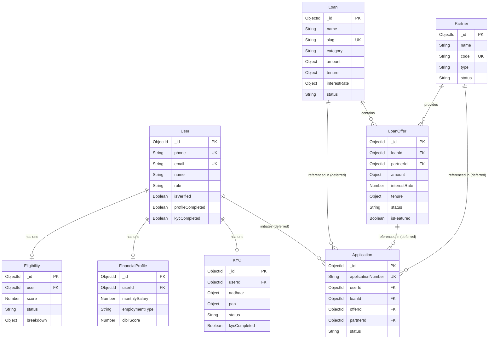
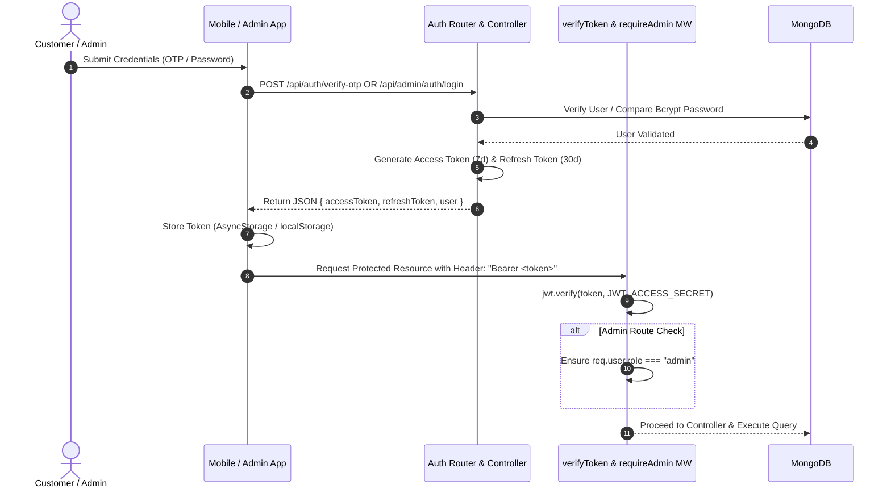
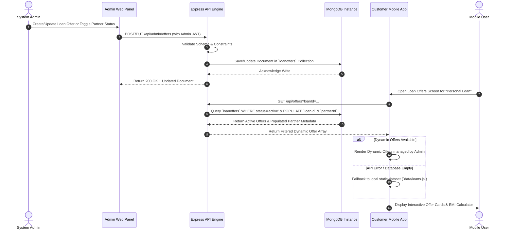
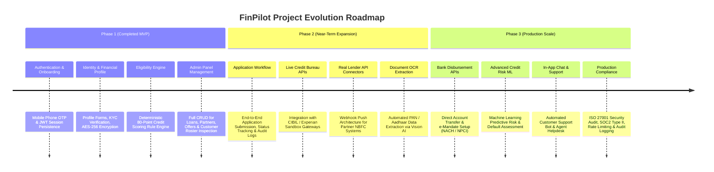

# FinPilot — Fintech Loan Discovery Platform

## Minimum Viable Product (MVP) Project Report

---

### Document Overview

* **Project Name:** FinPilot
* **Project Type:** Fintech Loan Discovery & Financial Eligibility Platform
* **Architecture:** Decoupled Monorepo Multi-Application (Mobile App + Admin Web Panel + Express REST Backend + MongoDB)
* **Target Platforms:** iOS & Android (Mobile App), Web Browsers (Admin Panel)
* **Technology Stack:** React Native (Expo), Redux Toolkit, React (Vite), Node.js, Express.js, MongoDB, Mongoose, Zod, JWT
* **Current Status:** Functional MVP / Working Prototype (Not Production-Ready)
* **Inspection Date:** March 2026

---

## 1. Executive Summary

**FinPilot** is a digital fintech loan discovery and financial eligibility platform designed to simplify how consumers explore curated credit options and how financial administrators manage credit products and lending partners.

In traditional lending environments, borrowers face opaque eligibility requirements, fragmented product information, and repetitive data entry across multiple banking sites. FinPilot solves this by providing a unified customer-facing mobile application coupled with a centralized administrator management panel. Customers enter their basic profile details, complete digital KYC verification, and provide financial attributes (salary, employment, existing liabilities, and credit score) to receive an instant algorithmic eligibility score and personalized loan offers from verified banking and Non-Banking Financial Company (NBFC) partners.

This report presents a comprehensive technical audit of the current FinPilot codebase as it exists today across its three core sub-repositories: `mobile/`, `admin/`, and `backend/`. It documents implemented features, underlying system architecture, data models, API endpoints, business logic rules, dynamic data flows, known prototype limitations, and explicitly deferred functionality.

---

## 2. Project Objective

The primary objective of the FinPilot platform is to demonstrate an end-to-end, dynamic loan discovery and eligibility ecosystem. The platform achieves this through the following core operational objectives:

* **Customer Authentication & Onboarding:** Mobile phone-based OTP verification, account creation, and persistent session management.
* **Personal Profile Management:** Digital collection and persistence of user identity attributes (name, date of birth, gender, residential address).
* **Identity Verification (KYC):** Masked and encrypted collection of Aadhaar and PAN credentials with document scan uploads, supporting both live Sandbox API verification and configurable mock testing.
* **Financial Profile & Credit Scoring:** Capture of monthly income, employment status, company name, existing loan counts, current monthly EMI obligations, and self-reported/sandbox CIBIL scores.
* **Algorithmic Eligibility Calculation:** Automated execution of a deterministic scoring engine that computes a 0–80 point credit rating and assigns an overall `eligible` or `not_eligible` status.
* **Loan Product Catalog & Discovery:** Categorized exploration of loan products (Personal, Home, Business, Education, Vehicle, Gold) with dynamic filter parameters.
* **Lender Offer Exploration:** Interactive discovery of partner-specific loan offers featuring calculated interest rates, loan tenure bounds, and processing fee structures.
* **Admin-Driven Content Management:** Full CRUD administration of loan categories, lending partners (Banks/NBFCs), loan offers, customer rosters, and high-level platform analytics via a web dashboard.

---

## 3. System Overview

FinPilot employs a decoupled, service-oriented multi-application architecture. The system consists of two front-end client applications interacting with a shared Node.js/Express REST API backend connected to a MongoDB database.

### High-Level System Architecture

```mermaid
flowchart TD
    subgraph Clients["Client Layer"]
        MobileApp["Customer Mobile Application\n(React Native / Expo)"]
        AdminPanel["Admin Web Panel\n(React / Vite + Tailwind)"]
    end

    subgraph Backend["Backend API Layer (Node.js / Express)"]
        AuthMiddleware["JWT Auth Middleware\n(verifyToken & requireAdmin)"]
        
        subgraph Routes["API Gateway & Routes"]
            AuthRoutes["/api/auth"]
            ProfileRoutes["/api/profile"]
            KycRoutes["/api/kyc"]
            EligRoutes["/api/eligibility"]
            LoanRoutes["/api/loans & /api/offers"]
            AdminRoutes["/api/admin/*"]
        end

        subgraph Services["Core Business Logic & Services"]
            EligEngine["Eligibility Engine"]
            CryptoService["AES-256-GCM Encryption"]
            SandboxService["Sandbox.co.in KYC Service"]
            CloudinaryService["Cloudinary Upload Storage"]
        end
    end

    subgraph Storage["Database & Cloud Storage"]
        MongoDB[("MongoDB Database\n(Mongoose ORM)")]
        Cloudinary[("Cloudinary CDN\n(Document/Image Assets)")]
    end

    MobileApp -->|HTTP REST + Bearer JWT| AuthRoutes
    MobileApp -->|HTTP REST + Bearer JWT| ProfileRoutes
    MobileApp -->|HTTP REST + Bearer JWT| KycRoutes
    MobileApp -->|HTTP REST + Bearer JWT| EligRoutes
    MobileApp -->|HTTP REST| LoanRoutes

    AdminPanel -->|HTTP REST + Admin JWT| AdminRoutes

    AuthRoutes --> AuthMiddleware
    ProfileRoutes --> AuthMiddleware
    KycRoutes --> AuthMiddleware
    EligRoutes --> AuthMiddleware
    AdminRoutes --> AuthMiddleware

    AuthMiddleware --> Services
    Services --> MongoDB
    KycRoutes -->|Document Uploads| CloudinaryService
    CloudinaryService --> Cloudinary
    SandboxService -.->|External API (Optional)| ExternalSandbox["Sandbox.co.in Gateway"]
```

### Component Responsibility Breakdown

1. **Customer Mobile Application (`mobile/`):** Built with React Native and Expo, providing an intuitive touch interface for customer registration, profile entry, document capture, eligibility check, and offer browsing.
2. **Admin Web Panel (`admin/`):** Built with React 19, Vite, and Tailwind CSS v4, enabling system administrators to monitor platform metrics, review customer profiles, manage partner institutions, and create or toggle loan products and offers.
3. **Express REST Backend (`backend/`):** Built on Node.js and Express 5, serving as the central coordinator for routing, request validation via Zod, JWT token verification, role-based authorization, encryption, eligibility calculation, and database querying.
4. **MongoDB Persistence Store:** Relies on Mongoose models for schema definition, index optimization, relationship referencing, and atomic document updates.

---

## 4. Technology Stack

The exact technologies utilized across the repository, verified directly from `package.json` manifests and source code, are detailed below:

| Layer | Technology | Version | Purpose & Implementation Details |
| :--- | :--- | :--- | :--- |
| **Mobile Runtime** | React Native | `0.86.0` | Cross-platform native mobile application framework. |
| **Mobile Toolchain** | Expo | `~57.0.8` | Development platform, build toolchain, and asset manager. |
| **Mobile State** | Redux Toolkit | `^2.12.0` | Global state management for authentication, user info, KYC, and eligibility. |
| **Mobile Persistence**| Redux Persist | `^6.0.0` | Offline persistence of Redux state using `@react-native-async-storage/async-storage`. |
| **Mobile Navigation** | React Navigation | `^7.3.8` | Native Stack navigator for managing application view transitions. |
| **Mobile UI & Animation**| Reanimated & Linear Gradient| `^4.5.1` | High-performance 60fps animations, collapsible headers, and custom gradient components. |
| **Admin Frontend** | React | `^19.2.8` | Component-based user interface library for the administrator web dashboard. |
| **Admin Bundler** | Vite | `^8.2.2` | Next-generation frontend build tool and dev server. |
| **Admin Styling** | Tailwind CSS | `^4.3.3` | Utility-first CSS framework (configured via `@tailwindcss/vite`). |
| **Admin Navigation** | React Router DOM | `^7.18.2` | Declarative client-side routing and protected route management. |
| **Backend Runtime** | Node.js (CommonJS) | `>=18.0.0` | Server-side JavaScript execution environment (`type: commonjs`). |
| **Backend Framework** | Express.js | `^5.2.1` | HTTP web server and RESTful routing framework. |
| **Database** | MongoDB | Cloud Atlas | NoSQL document-oriented database. |
| **Database ORM** | Mongoose | `^9.7.4` | Object Data Modeling (ODM) library for MongoDB schema enforcement and queries. |
| **Authentication** | JSON Web Token (JWT) | `^9.0.3` | Dual-token security architecture (Access Token: 7d, Refresh Token: 30d). |
| **Password Hashing** | Bcrypt | `^6.0.0` | Salted hashing algorithm for securing admin password credentials. |
| **Data Validation** | Zod | `^4.4.3` | TypeScript-first schema validation for API request body verification. |
| **Data Security** | AES-256-GCM (`crypto`) | Native | Authenticated symmetric encryption for sensitive PII (Aadhaar & PAN numbers). |
| **Media Handling** | Multer & Cloudinary | `^2.2.0` | Multipart form-data parser and Cloudinary CDN storage engine integration. |
| **External KYC Integration**| Axios & Sandbox.co.in | `^1.19.0` | HTTP client for interacting with Sandbox.co.in OpenAPI endpoints (with mock fallback). |

---

## 5. Database Architecture

The backend database architecture consists of nine Mongoose models defined under `backend/src/models/`.

### Entity-Relationship Diagram



### Detailed Entity Specifications

#### 1. `User` (`user.model.js`)
* **Purpose:** Core user identity collection handling both customer mobile accounts and administrative accounts.
* **Fields:** `phone` (Number, Unique, Required), `email` (String, Unique, Sparse), `countryCode` (String, default `+91`), `name` (String), `dob` (Date), `gender` (String), `role` (`customer` | `admin`, default `customer`), `password` (String, hashed with bcrypt for admin), `profileImage` (String URL), `address`, `city`, `state`, `pincode` (Strings), `isVerified` (Boolean), `profileCompleted` (Boolean), `kycCompleted` (Boolean), `refreshToken` (String).
* **Timestamps:** Automatic (`createdAt`, `updatedAt`).

#### 2. `KYC` (`kyc.model.js`)
* **Purpose:** Stores identity verification documents and encrypted PII data.
* **Fields:** `userId` (Ref `User`, Unique, Required), `aadhaar` (`encrypted`, `iv`, `authTag`, `masked`), `pan` (`encrypted`, `iv`, `authTag`, `masked`), `aadhaarFront` (String URL), `aadhaarBack` (String URL), `panImage` (String URL), `aadhaarVerified` (Boolean), `panVerified` (Boolean), `status` (`pending` | `approved` | `rejected`, default `pending`), `kycCompleted` (Boolean), `aadhaarResponse` (Object), `panResponse` (Object), `verifiedAt` (Date).

#### 3. `FinancialProfile` (`financialProfile.model.js`)
* **Purpose:** Captures applicant employment attributes and financial capacity.
* **Fields:** `userId` (Ref `User`, Unique, Required), `monthlySalary` (Number, min 0), `employmentType` (`salaried` | `self-employed` | `business` | `other`), `company` (String, max 150), `existingLoans` (Number, min 0), `existingEmi` (Number, min 0), `cibilScore` (Number, 300–900), `cibilSource` (`manual` | `cibil` | `sandbox`), `cibilVerified` (Boolean).

#### 4. `Eligibility` (`eligibility.model.js`)
* **Purpose:** Holds calculated credit scoring results and diagnostic breakdowns.
* **Fields:** `user` (Ref `User`, Unique, Required), `score` (Number, 0–80), `status` (`eligible` | `not_eligible`), `breakdown` (`cibil`: 0–30, `salary`: 0–20, `existingLoans`: 0–30), `calculatedAt` (Date).

#### 5. `Loan` (`loan.model.js`)
* **Purpose:** Master catalog of loan categories and baseline product boundaries.
* **Fields:** `name` (String), `slug` (String, Unique, Lowercase), `category` (`personal` | `home` | `business` | `education` | `vehicle` | `gold`), `description` (String), `amount` (`min`, `max`, `step`), `tenure` (`min`, `max`, `unit`), `interestRate` (`min`, `max`, `unit`), `features` ([String]), `status` (`active` | `inactive`), `displayOrder` (Number).

#### 6. `Partner` (`partner.model.js`)
* **Purpose:** Registered lending institutions (Banks and NBFCs).
* **Fields:** `name` (String), `code` (String, Unique, Uppercase e.g. `HDFC`), `type` (`Bank` | `NBFC`), `logo` (String URL), `status` (`active` | `inactive`).

#### 7. `LoanOffer` (`loanOffer.model.js`)
* **Purpose:** Specific lender offerings linked to a loan product and partner institution.
* **Fields:** `loanId` (Ref `Loan`, Required), `partnerId` (Ref `Partner`, Required), `amount` (`min`, `max`), `interestRate` (Number), `tenure` (`min`, `max`, `unit`), `processingFee` (String), `eligibilityCriteria` (`minCibilScore`, `minMonthlySalary`), `status` (`active` | `inactive`), `displayOrder` (Number), `isFeatured` (Boolean).

#### 8. `Application` (`application.model.js`)
* **Purpose:** Defined database schema for capturing submitted loan requests, financial snapshots, offer snapshots, and status audit trails (`submitted`, `under_review`, `referred_to_partner`, `approved_by_partner`, `rejected`, `disbursed`).
* **Implementation Note:** **Deferred / Not Implemented in API & Frontend.** While the schema is fully defined in backend code, no active application endpoints or client application submission forms are exposed in the MVP.

#### 9. `Otp` (`otp.model.js`)
* **Purpose:** Transient storage for phone verification OTP codes.
* **Fields:** `phone` (String, Indexed), `otp` (String), `expiresAt` (Date), `attempts` (Number, default 0).

---

## 6. Customer Mobile Application

The customer application is located under `mobile/` and structured around modular screen workflows and Redux state management.

### Key Implemented Modules

```
mobile/src/screens/
├── Auth/              # Registration & OTP Verification
├── Home/              # Dashboard, Banner & Navigation Hub
├── KYC/               # Aadhaar & PAN Digital Upload / Verification
├── Profile/           # Personal Profile Form & Details View
├── Eligibilty/        # Income / CIBIL Entry & Instant Eligibility Result
├── Loan/              # Bento Grid Explorer & Loan Offer Listing
├── Onboarding/         # Intro Carousel Slides
├── Splash/            # Startup Splash & Hydration Loading
└── Startup/           # Redux/Token Bootstrapper
```

#### Module Breakdown

1. **Authentication (`RegisterScreen.jsx`, `VerificationCode.jsx`):**
   * **Purpose:** Phone number entry, simulated OTP generation, OTP validation, JWT token storage, and session creation.
   * **API Interacted:** `POST /api/auth/send-otp`, `POST /api/auth/verify-otp`.
   * **Data Source:** Dynamic MongoDB backend (`User` and `Otp` collections).

2. **Personal Profile (`ProfileScreen.jsx`, `ProfileDetailScreen.jsx`):**
   * **Purpose:** Captures full name, DOB, gender, address, city, state, pincode, and optional avatar image.
   * **API Interacted:** `GET /api/profile`, `PUT /api/profile` (with `multer` multipart upload).
   * **Data Source:** Dynamic MongoDB backend (`User` document).

3. **KYC Verification (`KycScreen.jsx`, `AadhaarScreen.jsx`, `PanScreen.jsx`):**
   * **Purpose:** Two-step verification capturing 12-digit Aadhaar (OTP based) and 10-character PAN details alongside document uploads. Masked numbers (`XXXX-XXXX-1234`) are rendered upon success.
   * **API Interacted:** `POST /api/kyc/send-aadhaar-otp`, `POST /api/kyc/verify-aadhaar-otp`, `POST /api/kyc/verify-pan`, `GET /api/kyc/status`.
   * **Data Source:** Dynamic MongoDB backend (`KYC` collection), integrated with Sandbox API or `mockKyc.js` sandbox service.

4. **Financial Profile & Eligibility (`EligibilityScreen.jsx`):**
   * **Purpose:** Interactive slide-over / multi-step form collecting salary, employment type, existing EMI, and CIBIL score. Displays instant animated score wheel (0–80) and breakdown cards upon calculation.
   * **API Interacted:** `POST /api/eligibility/calculate`, `GET /api/eligibility`.
   * **Data Source:** Dynamic MongoDB backend (`FinancialProfile` & `Eligibility` collections).

5. **Loan Catalog & Discovery (`LoanExplorerScreen.jsx`):**
   * **Purpose:** Bento-grid visual catalog showcasing six loan types (Personal, Home, Business, Education, Vehicle, Gold) with amount callouts and category filters.
   * **Data Source:** Hybrid — renders static product data (`mobile/src/data/loans.js`) with navigation parameter passing.

6. **Loan Offer Exploration (`LoanOffersScreen.jsx`):**
   * **Purpose:** Displays available lender offers for a selected loan product. Features an interactive amount selector slider that recalculates estimated monthly EMI across listed offers.
   * **API Interacted:** `GET /api/offers?loanId=...`, `GET /api/loans`.
   * **Data Source:** Dynamic API response from MongoDB (`LoanOffer` populated with `Partner` and `Loan`), with automatic fallback to static local dataset (`loans.js`) if offline or empty.

---

## 7. Admin Web Panel

The Admin Panel is located under `admin/` and built as a modern Single Page Application (SPA).

### Admin Features & Capabilities

```
admin/src/pages/
├── auth/AdminLogin.jsx        # Admin Credentials Authentication
├── dashboard/Dashboard.jsx    # System Metric Analytics Cards
├── customer/Customers.jsx     # Customer Roster & Full Profile Drawer
├── loan/Loans.jsx             # Loan Product CRUD & Status Toggle
├── partner/Partners.jsx       # Bank/NBFC Partner CRUD & Deletion
└── offer/LoanOffers.jsx       # Loan Offer Management & Featured Toggles
```

1. **Admin Authentication (`AdminLogin.jsx`):**
   * Secure email/password login restricted to accounts with `role: "admin"`.
   * Verifies salted bcrypt password hashes stored in MongoDB.
   * Stores `adminAccessToken` in web browser `localStorage`.

2. **Dashboard Overview (`Dashboard.jsx`):**
   * Real-time platform metric cards displaying total registered customers, active loan products, active lending partners, and active loan offers.
   * Interacts with `GET /api/admin/dashboard/stats`.

3. **Customer Management (`Customers.jsx`):**
   * Searchable customer data table (searches by name, email, or phone number).
   * Detailed side-drawer inspection view aggregating Customer Account info, KYC verification status (with masked PII), Financial Profile data, and Eligibility calculation breakdowns.
   * Interacts with `GET /api/admin/customers` and `GET /api/admin/customers/:id`.

4. **Loan Product Management (`Loans.jsx`):**
   * Full creation and editing modal for loan categories.
   * Enforces min/max range constraints for loan amounts, tenures, and interest rates.
   * Direct active/inactive status toggle switch.
   * Interacts with `GET /api/admin/loans`, `POST /api/admin/loans`, `PUT /api/admin/loans/:id`, and status updates.

5. **Partner Management (`Partners.jsx`):**
   * Administration of Bank and NBFC institution profiles.
   * Code uniqueness enforcement (e.g., `HDFC`, `ICICI`, `BAJAJ`).
   * Supports partner logo URL assignment, status updates, and partner deletion.
   * Interacts with `GET /api/admin/partners`, `POST /api/admin/partners`, `PUT /api/admin/partners/:id`, `PUT /api/admin/partners/:id/status`, and `DELETE /api/admin/partners/:id`.

6. **Loan Offer Management (`LoanOffers.jsx`):**
   * Creation of lender offers linked dynamically to active loan products and active partners.
   * Configures interest rates, processing fee text, featured flags (`isFeatured`), and minimum eligibility constraints (`minCibilScore`, `minMonthlySalary`).
   * Interacts with `GET /api/admin/offers`, `POST /api/admin/offers`, `PUT /api/admin/offers/:id`, and `PATCH /api/admin/offers/:id/status`.

---

## 8. Backend API Documentation

The backend service runs on port `5000` by default. All endpoints are listed below.

### 1. Authentication APIs (`/api/auth`)

| Method | Endpoint | Description | Auth Required | Status Code |
| :--- | :--- | :--- | :--- | :--- |
| `POST` | `/api/auth/send-otp` | Generates 6-digit OTP for phone verification | None | 200 / 400 / 500 |
| `POST` | `/api/auth/verify-otp` | Validates OTP and returns JWT tokens + user object | None | 200 / 400 / 404 / 500 |

### 2. Customer Profile APIs (`/api/profile`)

| Method | Endpoint | Description | Auth Required | Status Code |
| :--- | :--- | :--- | :--- | :--- |
| `GET` | `/api/profile` | Fetches current user's profile document | Bearer JWT | 200 / 401 / 404 / 500 |
| `PUT` | `/api/profile` | Updates identity fields & profile image upload | Bearer JWT | 200 / 400 / 401 / 500 |

### 3. KYC Verification APIs (`/api/kyc`)

| Method | Endpoint | Description | Auth Required | Status Code |
| :--- | :--- | :--- | :--- | :--- |
| `POST` | `/api/kyc/send-aadhaar-otp` | Triggers Aadhaar OTP via Sandbox / Mock service | Bearer JWT | 200 / 400 / 401 / 500 |
| `POST` | `/api/kyc/verify-aadhaar-otp` | Verifies Aadhaar OTP, encrypts & stores Aadhaar PII | Bearer JWT | 200 / 400 / 401 / 500 |
| `POST` | `/api/kyc/verify-pan` | Verifies PAN details, encrypts & stores PAN PII | Bearer JWT | 200 / 400 / 401 / 500 |
| `GET` | `/api/kyc/status` | Returns current KYC verification state & masked data | Bearer JWT | 200 / 401 / 500 |

### 4. Financial & Eligibility APIs (`/api/eligibility`)

| Method | Endpoint | Description | Auth Required | Status Code |
| :--- | :--- | :--- | :--- | :--- |
| `POST` | `/api/eligibility/calculate` | Saves financial profile & executes eligibility scoring | Bearer JWT | 200 / 400 / 401 / 500 |
| `GET` | `/api/eligibility` | Fetches user's calculated eligibility & breakdown | Bearer JWT | 200 / 401 / 500 |

### 5. Customer Catalog APIs (`/api/loans` & `/api/offers`)

| Method | Endpoint | Description | Auth Required | Status Code |
| :--- | :--- | :--- | :--- | :--- |
| `GET` | `/api/loans` | Fetches active loan products (filterable by category)| None | 200 / 500 |
| `GET` | `/api/loans/:slug` | Fetches single active loan product by slug or ObjectId | None | 200 / 404 / 500 |
| `GET` | `/api/offers` | Fetches active loan offers (populated with loan & partner)| None | 200 / 500 |
| `GET` | `/api/offers/:id` | Fetches single active loan offer details | None | 200 / 400 / 404 / 500 |

### 6. Admin Panel APIs (`/api/admin/*`)

| Method | Endpoint | Description | Auth Required | Status Code |
| :--- | :--- | :--- | :--- | :--- |
| `POST` | `/api/admin/auth/login` | Authenticates administrator credentials | None | 200 / 400 / 401 / 403 |
| `GET` | `/api/admin/dashboard/stats` | Fetches summary count statistics | Admin JWT | 200 / 401 / 403 / 500 |
| `GET` | `/api/admin/customers` | Lists customer records with search query filter | Admin JWT | 200 / 401 / 403 / 500 |
| `GET` | `/api/admin/customers/:id` | Deep inspection of customer identity, KYC, financial & eligibility | Admin JWT | 200 / 401 / 403 / 404 / 500 |
| `GET` | `/api/admin/loans` | Lists all loan products (active & inactive) | Admin JWT | 200 / 401 / 403 / 500 |
| `POST` | `/api/admin/loans` | Creates a new loan product | Admin JWT | 200 / 400 / 409 / 500 |
| `PUT` | `/api/admin/loans/:id` | Updates loan product parameters | Admin JWT | 200 / 400 / 404 / 409 / 500 |
| `PUT` | `/api/admin/loans/:id/status`| Toggles loan product active/inactive state | Admin JWT | 200 / 400 / 404 / 500 |
| `GET` | `/api/admin/partners` | Lists all partner institutions | Admin JWT | 200 / 401 / 403 / 500 |
| `POST` | `/api/admin/partners` | Registers a new Bank or NBFC partner | Admin JWT | 200 / 400 / 409 / 500 |
| `PUT` | `/api/admin/partners/:id` | Updates partner details | Admin JWT | 200 / 400 / 404 / 409 / 500 |
| `PUT` | `/api/admin/partners/:id/status`| Toggles partner active/inactive status | Admin JWT | 200 / 400 / 404 / 500 |
| `DELETE`| `/api/admin/partners/:id` | Deletes a partner institution record | Admin JWT | 200 / 400 / 404 / 500 |
| `GET` | `/api/admin/offers` | Lists all loan offers with populated references | Admin JWT | 200 / 401 / 403 / 500 |
| `POST` | `/api/admin/offers` | Creates a new lender offer | Admin JWT | 200 / 400 / 404 / 500 |
| `PUT` | `/api/admin/offers/:id` | Updates loan offer parameters | Admin JWT | 200 / 400 / 404 / 500 |
| `PATCH` | `/api/admin/offers/:id/status`| Toggles loan offer active/inactive state | Admin JWT | 200 / 400 / 404 / 500 |

---

## 9. Authentication & Authorization

FinPilot enforces stateless identity management using JSON Web Tokens (JWT).



### Security Details

1. **Token Duration & Secret Management:** Access tokens are signed with `JWT_ACCESS_SECRET` and expire in 7 days. Refresh tokens are signed with `JWT_REFRESH_SECRET` and expire in 30 days.
2. **Password Security:** Admin passwords are standardly salted and hashed using `bcrypt` (10 rounds). Customer phone verification uses randomly generated 6-digit numeric OTPs stored in an expiring TTL collection.
3. **Role-Based Access Control (RBAC):** Middleware checks `req.user.role`. Customer tokens attempting to access `/api/admin/*` routes are rejected with HTTP 403 Forbidden.
4. **Client Storage:** Tokens are persisted locally via `@react-native-async-storage/async-storage` on mobile devices and `localStorage` on web browsers.

---

## 10. Core Business Logic

### 1. Algorithmic Credit Scoring & Eligibility Engine

The eligibility engine (`backend/src/services/eligibility.service.js`) computes a deterministic credit assessment on a maximum scale of **80 points**:

$$\text{Total Score} = \text{CIBIL Points (max 30)} + \text{Salary Points (max 20)} + \text{Existing Loan Points (max 30)}$$

#### Scoring Rule Matrices

* **CIBIL Score Points (Max 30):**
  * $\ge 750 \implies 30\text{ points}$
  * $700 - 749 \implies 20\text{ points}$
  * $650 - 699 \implies 10\text{ points}$
  * $< 650 \implies 0\text{ points}$

* **Monthly Salary Points (Max 20):**
  * $\ge ₹50,000 \implies 20\text{ points}$
  * $₹30,000 - ₹49,999 \implies 10\text{ points}$
  * $< ₹30,000 \implies 0\text{ points}$

* **Existing Active Loans Points (Max 30):**
  * $0\text{ existing loans} \implies 30\text{ points}$
  * $1\text{ existing loan} \implies 20\text{ points}$
  * $2\text{ existing loans} \implies 10\text{ points}$
  * $> 2\text{ existing loans} \implies 0\text{ points}$

#### Eligibility Status Assignment
* $\text{Total Score} \ge 70 \implies \mathbf{eligible}$
* $\text{Total Score} < 70 \implies \mathbf{not\_eligible}$

### 2. Sensitive Data Encryption (AES-256-GCM)

All primary identity numbers (Aadhaar and PAN) sent during KYC verification are encrypted at rest prior to MongoDB storage using `backend/src/services/encryption.service.js`.
* **Cipher:** AES-256-GCM (`aes-256-gcm`).
* **Key Requirement:** 32-byte base64 decoded key from `ENCRYPTION_KEY`.
* **Storage Payload:** Stores `encrypted` ciphertext, `iv` (Initialization Vector), `authTag` (GCM Authentication Tag), and a plain-text `masked` representation (e.g., `XXXX-XXXX-5678`).

### 3. Validation & Relational Constraints

* **Loan & Offer Range Validation:** Ensures $\text{Min Amount} \le \text{Max Amount}$ and $\text{Min Tenure} \le \text{Max Tenure}$. Offers cannot be created with amount bounds exceeding the parent Loan product boundaries.
* **Cascading Status Propagation:** Disabling a Loan product or Partner institution automatically suppresses their associated offers from being served over the `/api/offers` customer API.

---

## 11. Admin → Database → Customer Data Flow

A core architectural strength of FinPilot is its dynamic data cascade. Content created or updated in the Admin Web Panel dynamically alters the offerings presented on customer mobile devices.



---

## 12. Dynamic Data Readiness Matrix

The table below reflects the exact data source readiness across all system entities in the current implementation:

| Module / Entity | Database Model | Dynamic API Backend? | Mobile App Integration? | Admin Management? | Current Operational Status |
| :--- | :--- | :--- | :--- | :--- | :--- |
| **Users / Auth** | `User` | ✅ Yes | ✅ Yes | ✅ Read-only view | ✅ **Fully Dynamic** |
| **User Profile** | `User` | ✅ Yes | ✅ Yes | ✅ Read-only view | ✅ **Fully Dynamic** |
| **KYC Verification**| `KYC` | ✅ Yes | ✅ Yes | ✅ Read-only view | 🟡 **Dynamic (Sandbox / Mock)** |
| **Financial Profile**| `FinancialProfile`| ✅ Yes | ✅ Yes | ✅ Read-only view | ✅ **Fully Dynamic** |
| **Eligibility** | `Eligibility` | ✅ Yes | ✅ Yes | ✅ Read-only view | ✅ **Fully Dynamic** |
| **Loan Catalog** | `Loan` | ✅ Yes | 🟡 Hybrid (Static fallback)| ✅ Full CRUD | 🟡 **Dynamic Backend / Hybrid Mobile** |
| **Partners** | `Partner` | ✅ Yes | 🟡 Indirect via Offers | ✅ Full CRUD | ✅ **Fully Dynamic** |
| **Loan Offers** | `LoanOffer` | ✅ Yes | 🟡 Hybrid (Static fallback)| ✅ Full CRUD | 🟡 **Dynamic Backend / Hybrid Mobile** |
| **Loan Applications**| `Application` | ❌ No API Routes | ❌ No UI Screen | ❌ Placeholder view | ⏸️ **Deferred / Schema Only** |

---

## 13. UI/UX & Design Implementation

The mobile app and admin web panel adhere to polished modern design standards:

* **Mobile App UI (`mobile/`):**
  * Built using custom color tokens (`Colors.primary`: `#3270FF`), smooth gradients (`expo-linear-gradient`), and custom SVG icons.
  * Incorporates Bento Grid layouts on the `LoanExplorerScreen` for categorized product presentation.
  * Implements high-performance scroll animations via `react-native-reanimated` for sticky/collapsible headers.
  * Implements `HomeSkeleton` loading states, interactive amount sliders (`@react-native-community/slider`), and dynamic EMI calculators.
* **Admin Web Panel UI (`admin/`):**
  * Clean, modern dashboard layout utilizing Tailwind CSS v4 and `lucide-react` icons.
  * Features statistical cards, search filters, interactive tabbed tables, status badge indicators (`active` vs `inactive`), slide-over customer detail inspection drawers, and modal dialog forms.

---

## 14. Validation & Error Handling

* **Payload Validation:** Both customer and admin backend routes process incoming HTTP request bodies through strict Zod schemas (`auth.validation.js`, `profile.validation.js`, `kyc.validation.js`, `eligibility.validation.js`). Invalid requests immediately return HTTP 400 Bad Request with explicit validation issue messages.
* **Mongoose Schema Safeguards:** Model schemas enforce strict data type boundaries, enums, required properties, and duplicate index checks (e.g., unique email, unique phone, unique loan slug, unique partner code).
* **Global Error Middleware:** A centralized Express error-handling middleware (`app.use((err, req, res, next) => ...)` in `backend/index.js`) catches unexpected runtime errors and async middleware exceptions (such as file upload failures), logging errors silently to the server console and returning clean HTTP 500 JSON responses.
* **Standardized Response Utility:** HTTP responses adhere to a uniform JSON payload format defined in `backend/src/utils/response.js`:
  ```json
  {
    "success": true,
    "message": "Operation description",
    "data": {}
  }
  ```

---

## 15. Current MVP Implementation Status

The matrix below provides an empirical breakdown of the project status today:

| Module / Requirement | Status | Implementation Details & Evidence |
| :--- | :---: | :--- |
| **OTP Authentication** | ✅ Implemented | Phone verification via OTP, JWT token issuance, persistent user session creation. |
| **Customer Profile** | ✅ Implemented | Full name, DOB, gender, address fields saved to MongoDB via `/api/profile`. |
| **KYC Engine** | 🟡 Partially Implemented | Aadhaar & PAN verification implemented via AES-256-GCM encryption & Sandbox API integration with configurable `USE_MOCK_KYC` toggle. |
| **Financial Profile** | ✅ Implemented | Income, employment, company, existing loans, and CIBIL score persisted to MongoDB. |
| **Eligibility Engine** | ✅ Implemented | 80-point deterministic calculation algorithm computing score and status breakdown. |
| **Loan Product Catalog**| ✅ Implemented | Active loan query API supported by MongoDB with full Admin Panel management. |
| **Partner Management** | ✅ Implemented | Bank/NBFC partner registration, status toggles, and deletion supported in Admin. |
| **Loan Offers** | ✅ Implemented | Lender offers linked to loans and partners, featuring dynamic EMI slider calculations. |
| **Admin Dashboard** | ✅ Implemented | Secure admin authentication, dashboard metrics, customer inspection drawer, and CRUD modules. |
| **Loan Applications** | ⏸️ Deferred | `application.model.js` exists, but application submission, underwriting APIs, and client submission screens are intentionally deferred. |

---

## 16. Deferred Features & Out-of-Scope Modules

To maintain clear boundaries for the MVP evaluation, the following modules are explicitly documented as **deferred / out of scope** in the current codebase:

1. **Loan Application Submission & Tracking Workflow:** While an `Application` schema exists in `application.model.js`, there are no active routes in `backend/index.js` nor application submission buttons in the mobile UI.
2. **Real Bank / Core Banking Integrations:** No direct host-to host integrations exist with commercial bank core systems for automated loan origination or instant credit approval.
3. **Automated Credit Bureau Integration:** Credit scores are provided manually by the user or fetched via sandbox testing routines rather than live credit bureau API pulls (Experian/Equifax/CIBIL).
4. **Loan Disbursement & Payment Processing:** No payment gateway (Razorpay/Cashfree) or electronic fund transfer mechanisms are connected.
5. **Document Verification AI / OCR:** Document images uploaded to Cloudinary are stored as reference image URLs without automated OCR extraction.

---

## 17. Known Prototype Limitations

* **Mock Verification Mode:** In development mode (`USE_MOCK_KYC=true`), identity verification relies on simulated OTPs (`mockKyc.js`) and regex matching.
* **Hybrid Mobile Dataset:** `LoanExplorerScreen.jsx` relies primarily on local static configuration data (`data/loans.js`), while `LoanOffersScreen.jsx` fetches dynamically from the backend with static fallback.
* **Single Environment Setup:** Hardcoded CORS settings (`cors()`) and default local API base URLs (`http://localhost:5000/api`).
* **No Automated Underwriting:** Admin panel provides customer profile inspection but does not yet feature automated underwriting decision controls.

---

## 18. Testing & Functional Verification

### Automated Test Suite Status

> **Notice:** No automated unit or integration test suite (e.g., Jest, Supertest, Cypress, React Native Testing Library) was identified in the inspected codebase.

Development verification relies on manual API testing scripts (`test_all_scenarios.js`, `test_encryption.js`, `test_sandbox.js`) located in the `backend/` directory.

### Manual MVP Verification Checklist

To verify the functional baseline of the MVP, execute the following manual workflow:

- [x] **Backend Server Boot:** Execute `npm run dev` in `backend/`. Confirm MongoDB connection and output `Server running on 5000`.
- [x] **Admin Login:** Access `http://localhost:5173/admin/login`. Enter admin credentials created via `createAdminPassword.js`. Verify dashboard redirect.
- [x] **Partner & Product Setup:** In Admin, create a Partner (e.g., `HDFC Bank`) and create a Loan Product (e.g., `Personal Loan`). Add a Loan Offer linking both.
- [x] **Customer Mobile Register:** Boot Expo app in `mobile/`. Enter phone number, verify OTP, and proceed to home dashboard.
- [x] **Complete Identity & Financial Profile:** Fill personal details, complete KYC verification screens, and submit financial profile.
- [x] **Run Eligibility Calculation:** Check instant credit score computation (0–80) on `EligibilityScreen.jsx`.
- [x] **Discover Offers:** Navigate to `LoanExplorerScreen.jsx` $\rightarrow$ Select `Personal Loan`. Confirm offers are displayed and EMI slider dynamically recalculates values.
- [x] **Admin Roster Inspection:** Refresh Admin Panel `Customers` tab. Open customer side drawer and verify that all registered KYC, Financial, and Eligibility data is visible.

---

## 19. Future Scope & Development Roadmap



---

## 20. Project Structure

```
FinPilot/
├── backend/
│   ├── index.js                      # Express App Initialization & Route Mounting
│   ├── package.json                  # Node Dependencies & Scripts
│   ├── createAdminPassword.js        # Admin User Initialization Utility
│   └── src/
│       ├── config/                   # Environment & Third-Party Configurations
│       ├── controllers/              # REST Request Handlers
│       │   ├── admin/                # Admin Panel Controllers (Auth, Customers, Loans, Partners, Offers)
│       │   └── ...                   # Customer Controllers (Auth, Profile, KYC, Eligibility, Loans)
│       ├── middleware/               # JWT Auth & Multer File Upload Middleware
│       ├── models/                   # Mongoose Schemas (User, KYC, Eligibility, Loan, Partner, etc.)
│       ├── routes/                   # Router Modules (Customer & Admin Prefix Routes)
│       ├── services/                 # Business Logic (Eligibility Engine, AES Encryption, Sandbox API)
│       ├── utils/                    # Response Formatter, Data Masking & Mock KYC Helpers
│       └── validations/              # Zod Payload Validation Schemas
│
├── mobile/
│   ├── App.js                        # React Native Core Entrypoint
│   ├── package.json                  # React Native / Expo Dependencies
│   └── src/
│       ├── api/                      # Axios API Service Connectors
│       ├── components/               # Custom UI Components, Bento Cards & Skeletons
│       ├── data/                     # Static Fallback Dataset (loans.js)
│       ├── navigation/               # React Navigation Stack Configurers
│       ├── redux/                    # Redux Toolkit Slices, Actions & Store Config
│       ├── screens/                  # Customer App Views (Auth, KYC, Eligibility, Loans, Profile)
│       └── theme/                    # Design System Color Tokens & Typography
│
├── admin/
│   ├── index.html                    # Vite Web Entry HTML
│   ├── package.json                  # React 19 / Vite / Tailwind Dependencies
│   └── src/
│       ├── App.jsx                   # Router Switch & Layout Nesting
│       ├── layouts/                  # Admin Navigation Header & Sidebar Layout
│       ├── pages/                    # Web Views (Dashboard, Customers, Loans, Partners, Offers)
│       ├── routes/                   # Protected Route Guards
│       └── services/                 # Axios API Layer for Admin Backend Endpoints
│
└── docs/
    └── FINPILOT_PROJECT_REPORT.md    # Master MVP Technical Documentation Report
```

---

## 21. Conclusion

The current implementation of **FinPilot** establishes a functional MVP foundation for a fintech loan discovery and eligibility platform. 

By unifying a customer-facing mobile application, a secure Node.js/Express REST backend, and an administrative control panel, the project successfully demonstrates end-to-end data flow: from user authentication and identity verification to dynamic eligibility calculation and administrator-managed loan product discovery.

While specific production integrations—such as live banking APIs, automated credit bureau queries, and end-to-end loan application processing—are intentionally deferred, the architecture is modular, decoupled, and cleanly structured to support future expansion into a production-grade lending platform.
