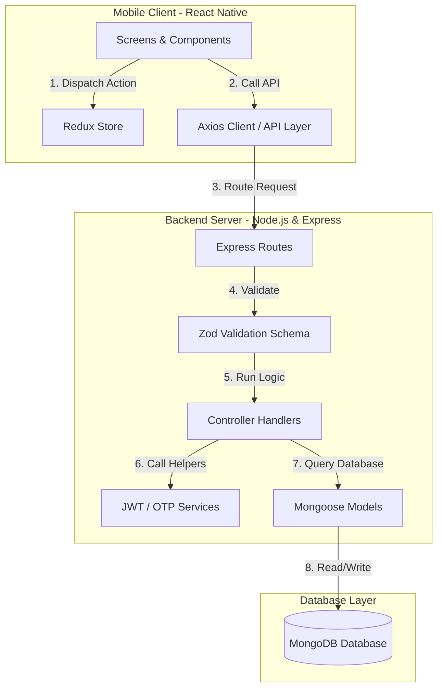

# Fintech Project Architecture Guide

This document provides a detailed breakdown of the directory structure and architecture for both the **Mobile** (React Native/Expo) and **Backend** (Node.js/Express) applications.

---

## 📱 Mobile App Architecture (`/mobile`)

The mobile application is built using **React Native (Expo)**, **Redux Toolkit** for state management, and **React Navigation** for routing. 

### Mobile Directory Tree
```text
mobile/
├── App.js                         # Application entry point, configures Root providers (Redux, Navigation)
├── app.json                       # Expo configuration (app name, splash screens, assets, permissions)
├── babel.config.js                # Babel preset configuration for React Native/Expo
├── index.js                       # App registry file mapping Expo app entry
├── package.json                   # Dependencies, scripts, and package information
└── src/                           # Mobile Source Root
    ├── api/                       # HTTP API client configurations (Axios base configuration)
    ├── components/                # Reusable UI component modules
    │   ├── buttons/               # Styled touchable button actions
    │   ├── cards/                 # Display card containers (e.g., product, loans)
    │   ├── common/                # Basic atom layout components
    │   │   ├── AppButton.js       # Reusable button layout
    │   │   ├── AppText.js         # Styled text configurations
    │   │   ├── BackButton.js      # Custom stack navigation back button
    │   │   ├── Logo.js            # Standardized brand logo asset component
    │   │   └── Screen.js          # Main wrapper providing safe-area layout padding
    │   ├── inputs/                # Input forms and controls
    │   │   └── AppInput.jsx       # Standard customized input text field
    │   ├── loaders/               # App progress indicator/loading screens
    │   └── onboarding/            # Slides, controls, and elements for onboarding
    ├── constants/                 # System static constants (URLs, static dropdown configurations, constants)
    ├── hooks/                     # Custom shared React hooks
    ├── navigation/                # Router configurations and stack navigators
    │   ├── AppNavigator.jsx       # Nested bottom tab / screen navigator for logged-in users
    │   ├── AppRouter.jsx          # Root router mapping authentication state to visible screens
    │   ├── AuthNavigator.jsx      # Navigation stack for authentication flow (login, register)
    │   └── RootNavigator.js       # Wrapper setup for React Navigation containers
    ├── redux/                     # Redux Toolkit Global State Config
    │   ├── actions/               # Custom Redux actions or async actions (thunks)
    │   ├── slices/                # State slice configurations
    │   │   ├── authSlice.js       # Slice handling auth token and session state
    │   │   └── userSlice.js       # Slice handling user profile information
    │   └── store.js               # Redux root store creation
    ├── screens/                   # Entire screen component views
    │   ├── Auth/                  # Auth screen controllers
    │   │   ├── RegisterScreen.jsx # Layout to enter register requirements
    │   │   └── VerificationCode.jsx # Layout for OTP inputs validation
    │   ├── Home/                  # Home dashboard
    │   │   └── HomeScreen.jsx     # Main financial dashboard view
    │   ├── KYC/                   # KYC verification screens (documents upload, verification states)
    │   ├── Loan/                  # Loan applications and status flows
    │   ├── Onboarding/            # App onboarding sliders
    │   │   └── OnboardingScreen.jsx # Welcome/Onboarding screen
    │   ├── Profile/               # Profile management
    │   │   └── ProfileScreen.jsx  # Input profile details screen (e.g., DOB, Name, Email)
    │   ├── Splash/                # Standardized splash views
    │   │   └── SplashScreen.jsx   # Initial splash animation
    │   └── Startup/               # Route validation
    │       └── StartupScreen.jsx  # Evaluates session/token to redirect to Auth or Home
    ├── services/                  # Business services layer (AsyncStorage integration)
    ├── styles/                    # Global stylesheet definitions
    ├── theme/                     # Standardized design system configuration
    │   └── colors.js              # Theme color specifications (primary, light, dark, slate)
    └── utils/                     # Utility libraries (validators, formatters)
```

---

## ⚙️ Backend App Architecture (`/backend`)

The backend server is built using **Node.js**, **Express**, **MongoDB** via **Mongoose ORM**, and **Socket.io** for real-time events.

### Backend Directory Tree
```text
backend/
├── index.js                       # Imports and bootstraps Express & HTTP socket servers (entry point)
├── package.json                   # Dependencies, scripts (dev: nodemon, start: node) and settings
└── src/                           # Backend Source Root
    ├── config/                    # Environment, database config (MongoDB connection)
    ├── controllers/               # Route endpoints controller handlers (business logic)
    │   └── auth.controller.js     # Auth logic (signup, login, send-otp, verify-otp)
    ├── middleware/                # Route middlewares (token authentication, validator schema checkers)
    ├── models/                    # MongoDB schema model definitions
    │   ├── otp.model.js           # Schema configuration for OTP storage and TTL indexes
    │   └── user.model.js          # Schema configuration for User profiles
    ├── routes/                    # Route mapper endpoints
    │   └── auth.route.js          # Authentication routing mapping endpoints to controllers
    ├── services/                  # Business logics (OTP generation, JWT management)
    │   ├── jwt.service.js         # JWT generation, sign, and verify logic
    │   └── otp.service.js         # Logic to create, validate, or interface OTP services
    ├── socket/                    # Setup configurations for websocket actions and connections
    ├── uploads/                   # Temporary directory for handling uploaded files (Cloudinary middleware)
    ├── utils/                     # Unified utilities
    │   └── response.js            # Standardized JSON response formatting utility
    └── validations/               # Zod validation schema files
        └── auth.validation.js     # Validation schemas for authentication inputs (emails, phones)
```

---

## 🔗 Architecture Relationship & Data Flow

Below is a diagram showcasing how data flows between the user interface and the database model in this architecture:


